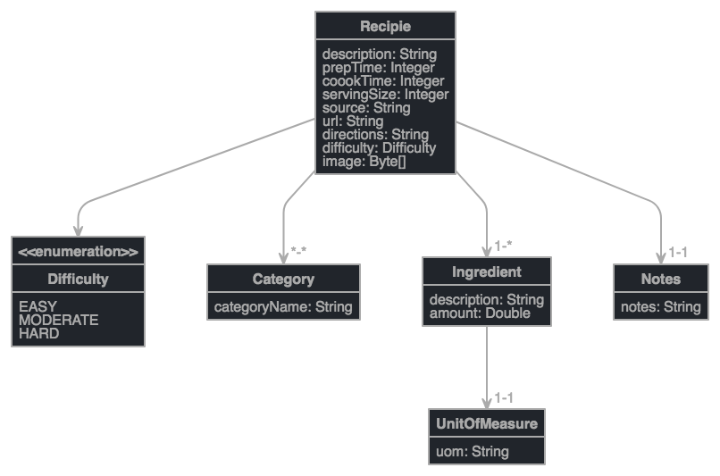

# Spring Boot Recipe Application
 
 ## Class Entity Modelling

[Click here to see the JDL Class Entity test](readme/jhipster-jdl.jh)

[Class Model Link](http://www.jhipster.tech/jdl-studio/#/view/entity%20Recipie%20%7B%0A%09description%20String%2C%0A%09prepTime%20Integer%2C%0A%20%20%20%20coookTime%20Integer%2C%0A%20%20%20%20servingSize%20Integer%2C%0A%20%20%20%20source%20String%2C%0A%20%20%20%20url%20String%2C%0A%20%20%20%20directions%20String%2C%0A%20%20%20%20difficulty%20Difficulty%2C%0A%20%20%20%20image%20Byte%5B%5D%0A%7D%0A%0Aentity%20Category%20%7B%0A%09categoryName%20String%0A%7D%0A%0Aentity%20Ingredient%20%7B%0A%09description%20String%2C%0A%09amount%20Double%0A%7D%0A%0Aentity%20UnitOfMeasure%20%7B%0A%09uom%20String%0A%7D%0A%0Aentity%20Notes%20%7B%0A%09notes%20String%0A%7D%0A%0Aenum%20Difficulty%20%7B%0A%09EASY%2C%20MODERATE%2C%20HARD%0A%7D%0A%0Arelationship%20OneToOne%20%7B%0A%09%20Ingredient%20to%20UnitOfMeasure%0A%7D%0A%0Arelationship%20ManyToMany%20%7B%0A%09Recipie%20to%20Category%0A%7D%0A%0Arelationship%20OneToMany%20%7B%0A%09Recipie%20to%20Ingredient%0A%7D%0A%0Arelationship%20OneToOne%20%7B%0A%09Recipie%20to%20Notes%0A%7D%0A)
